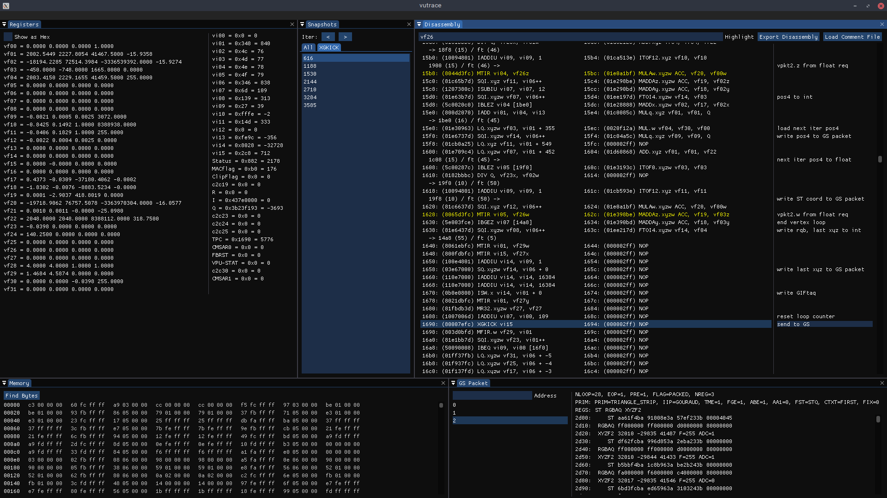

# vutrace

A tracing debugger for the PS2's second vector processing unit (VPU1). A modified version of PCSX2 can be used to dump out the state of VU1 after each instruction is executed, and the resultant traces can be viewed with the main vutrace application.

This is useful for reversing the renderers and model formats of PS2 games.

It should build on Linux (GCC) or Windows (MSVC) but has mainly been tested on Linux.

**The patch was last updated on 2022-11-16. The traces are no longer huge and trace sessions will actually start and stop on vsync!**

## Screenshot

## vutrace Usage

1. Checkout PCSX2 commit `e5bc1defa293524aa1da9cfbc568d5f986884801` and apply the patch `pcsx2_e5bc1defa293524aa1da9cfbc568d5f986884801.patch` to it using `git apply`, then build PCSX2 (wxWidgets version).

2. Build vutrace using cmake: `cmake -S . -B bin/ && cmake --build bin/`.

3. Launch PCSX2.

4. In PCSX2, use the VU1 interpreter, don't use the VU0 interpreter, and set GSdx to software mode. I haven't tested it with MTVU enabled, so don't use that.

5. Create a directory called `vutrace_output` in the working directory you ran PCSX2 from (it won't create the directory itself).

6. Trace a frame using the menu item `System->Begin VU trace...`.

7. Open a trace: `./vutrace (PCSX2 working dir)/vutrace_output/traceN.bin` where N is the index of the trace.

## vudis Usage

This is the disassembler split out into a seperate component.

1. Build vutrace using cmake: `cmake -S . -B bin/ && cmake --build bin/`.

2. Open a memory dump: `./vudis vu0MicroMem.bin`.

where `vu0MicroMem.bin` or `vu1MicroMem.bin` can be extracted from a PCSX2 save state. You may need to add `SavestateZstdCompression=disabled` to your `PCSX2_vm.ini` file in the `EmuCore` section for your savestates to be readable by certain archive utilities.

## Tips

- A LOG.txt file is written out with the trace with logs of all the VIF1 DMA transfers in it. If you know the address of one of the VIF command lists you're interested in, you can use this file to find the associated trace file.
- If you have the data you're interested in but not its address, you can VIF unpack (see EE User's Manual section 6.3.4) the data manually and binary grep for it.

## Keyboard Controls

- W - Step back one instruction.
- S - Step forward one instruction.
- A - Step back one loop iteration (until the PC is the same as it was originally).
- D - Step forward one loop iteration (until the PC is the same as it was originally).

## Known Issues

- vutrace: The GS packet parser assumes that the data transfer to the GS is instant.
- vutrace: Parsing of REGLIST primitives is not supported.
- patch: The framebuffer dumps aren't synced with the VU state dumps.

## Recent Changelog

### 2022-11-16

- Created version 3 of the trace file format, which drastically reduces file sizes by only storing registers and sections of memory that were modified.
- Trace sessions now start and end on vsync.

### 2022-10-18

- Added a slider for the row size in the memory view. [wagrenier](https://github.com/wagrenier)
- Fixed an issue preventing vutrace from being compiled on Windows. [wagrenier](https://github.com/wagrenier)

## File Formats

### Comments File

Stores the comments written in the text fields to the right of the disassembly in the vutrace GUI. Regular text file, one line per instruction pair.

### Trace File

Stores a series of snapshots recording the state of VU1 over the course of an execution of a microprogram. All fields are little-endian unless otherwise stated.

#### Version History

| Version | Notes |
| - | - |
| 3 | Replaced the VURegs struct with a more well-defined data format. Added `r` and `m` packet types. |
| 2 | Introduced a file header (really high tech). Updated the VURegs struct to use 64-bit pointers. |
| 1 | Initial version. |

#### File Structure

| Offset | Name | Type | Description |
| - | - | - | - |
| 0x0 | magic | u32 | Magic identifier. Equal to "VUTR" (big-endian). |
| 0x4 | version | u32 | Format version number (as described above). |
| 0x8 | packet 0 type | u8 | Byte identifying the type of the first packet. |
| 0x9 | packet 0 data | | Data stored for the first packet. |
| ... | ...  | ... | ... |
| | packet N-1 type  | u8 | Byte identifying the type of the last packet. |
| | packet N-1 data | | Data stored for the last packet. |

The last packet should be a `P` packet.

#### Packet Types

##### `P`

Push the current snapshot. The parser maintains a single snapshot as the current state and appends it to the snapshot list when this packet is encountered. No data.

##### `R`

Set the registers structure of the current snapshot. Data format:

| Offset | Name | Type | Descriptions |
| - | - | - | - |
| 0x0 | VF | u128[32] | The floating point registers. |
| 0x200 | VI | u128[32] | The integer registers. |
| 0x400 | ACC | u128 | The accumulator register. |
| 0x410 | Q | u128 | The Q register. |
| 0x420 | P | u128 | The P register. |

In version 2 of the format, the VURegs struct from PCSX2 was written to the file directly. In version 1 of this format, the 32-bit version of this struct was written directly.

##### `M`

Sets the current VU data memory for the current snapshot. Data consists of the raw memory (which is 16k in size).

##### `I`

Sets the current VU microcode memory for the current snapshot. Data consists of the raw memory (which is 16k in size).

##### `L`

Specifies that the lower instruction that executed between the last snapshot and this one loaded a value from VU memory. Data format:

| Offset | Name | Type | Descriptions |
| - | - | - | - |
| 0x0 | address | u32 | Address loaded from (in bytes). |
| 0x4 | size | u32 | Size of data loaded (in bytes). |

##### `S`

Specifies that the lower instruction that executed between the last snapshot and this one stored a value to VU memory. Note that this does not include DMA. Data format:

| Offset | Name | Type | Descriptions |
| - | - | - | - |
| 0x0 | address | u32 | Address stored to (in bytes). |
| 0x4 | size | u32 | Size of data stored (in bytes). |

##### `r` (since v3)

Patch the registers of the current snapshot. Data format:

| Offset | Name | Type | Descriptions |
| - | - | - | - |
| 0x0 | index | u8 | The register index. The `R` data above is treated as a single array of registers. |
| 0x2 | data | u128 | The contents of the register. |

##### `m` (since v3)

Patch the memory of the current snapshot. Data format:

| Offset | Name | Type | Descriptions |
| - | - | - | - |
| 0x0 | offset | u16 | VU memory address (in bytes). |
| 0x2 | data | u32 | Data to be written. |
